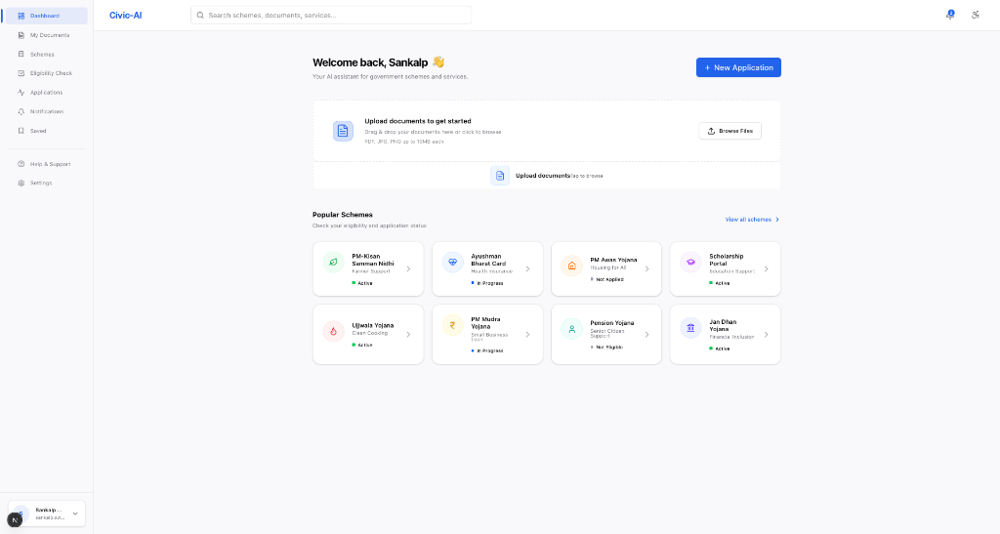

# Civic
Civic-AI is a modern, responsive web application and AI assistant designed to streamline the discovery and application process for government schemes and services. 


# Architecture

The project is structured as a full-stack application with a clean separation between the frontend interface and the backend API logic.

- **Frontend**: Built with **Next.js 14** (App Router), **React**, and **Tailwind CSS**. It features a modern, minimalist design system, responsive layouts for desktop and mobile, and interactive components.
- **Backend**: Powered by **FastAPI** (Python) and **MongoDB**. It handles user authentication, scheme data aggregation, document ingestion pipelines, and metadata management.

## Features

- **Dynamic Dashboard**: Responsive UI grid that adapts to any screen size.
- **Eligibility Checking Engine**: AI-assisted interactive wizard to check qualification for schemes.
- **Document Ingestion Area**: Drag-and-drop document upload pipeline with client-side validation.
- **Real-time Data Binding**: Live connection to FastAPI endpoints to fetch active user metadata and profiles.
- **Accessibility & Settings Controls**: Dynamic control over text scaling and high contrast modes.

---

## Getting Started

### Prerequisites
- [Node.js](https://nodejs.org/en/) (v18+)
- [Python](https://www.python.org/) (3.9+)
- [MongoDB](https://www.mongodb.com/) (Local or Atlas instance)

### 1. Backend Setup (FastAPI)

1. Navigate to the backend directory (or the root if using `main.py` directly):
   ```bash
   cd CIVIC-AI
   ```
2. Create and activate a Python virtual environment:
   ```bash
   python3 -m venv venv
   source venv/bin/activate  # On Windows use `venv\Scripts\activate`
   ```
3. Install the dependencies:
   ```bash
   pip install -r requirements.txt
   ```
4. Start the backend server:
   ```bash
   uvicorn main:app --reload --port 8000
   ```
   The API will be running at `http://localhost:8000`.


   cd C:\Users\baree\OneDrive\Desktop\HAKATHON\backend
.\venv\Scripts\Activate.ps1
python -m uvicorn main:app --reload --port 8000


git init
git add .
git commit -m "Initial commit"
git branch -M main
git remote add origin https://github.com/Bareera-Bilal/CIVIC-BACKEND.git
git push -u origin main

## Folder Structure

```text
CIVIC-AI/
├── frontend/             # Next.js Application
│   ├── src/app/          # App Router pages and global layouts
│   ├── src/components/   # Reusable UI components (Sidebar, Header, etc.)
│   └── src/hooks/        # Custom React hooks for data fetching
├── Routes/               # FastAPI route definitions (users, documents, etc.)
├── Models/               # Pydantic data models for API validation
├── main.py               # FastAPI application entry point
├── requirements.txt      # Python dependencies
└── docs/                 # Documentation assets and screenshots
```
